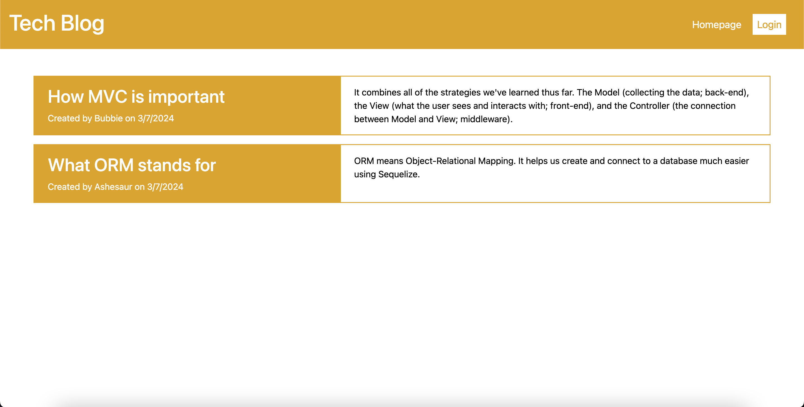
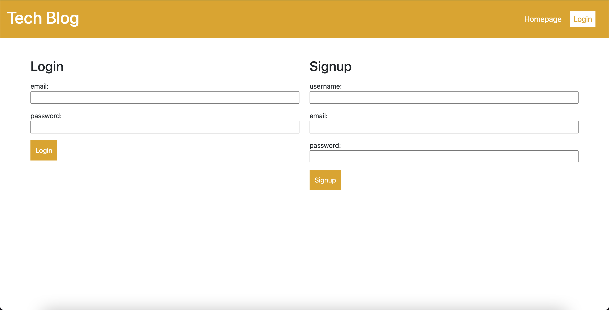
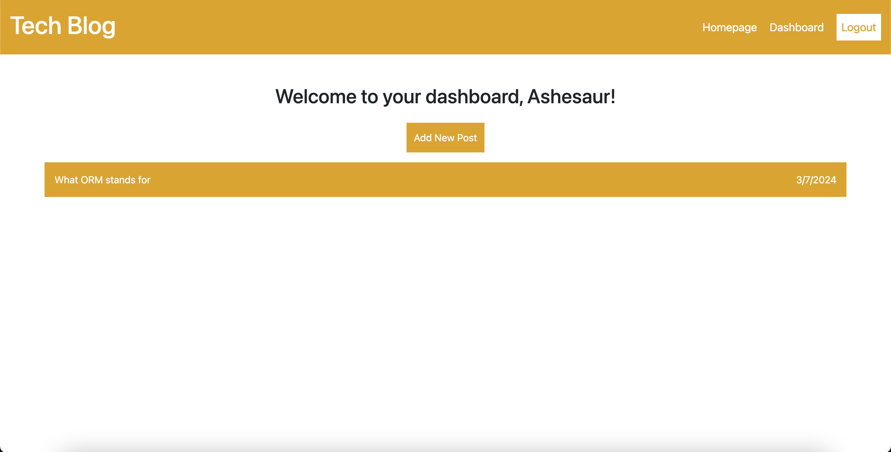
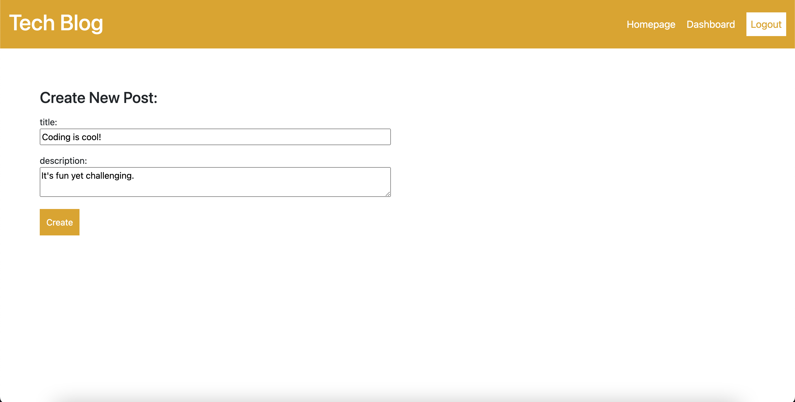
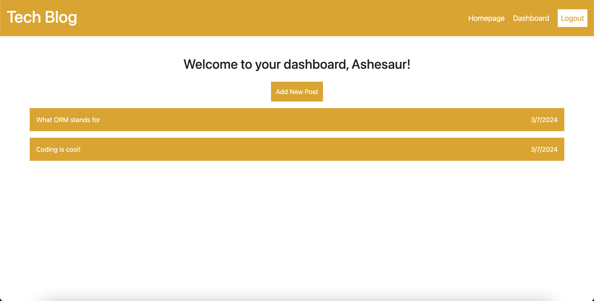
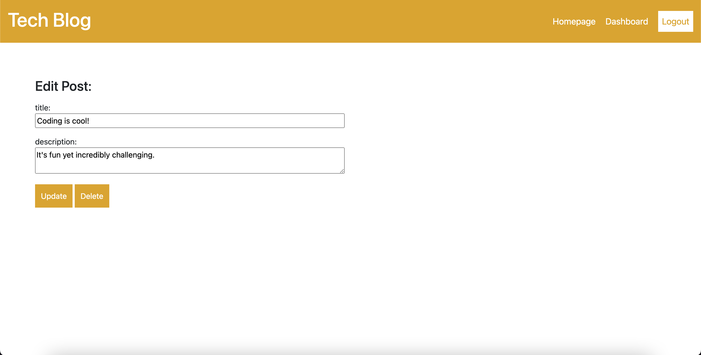
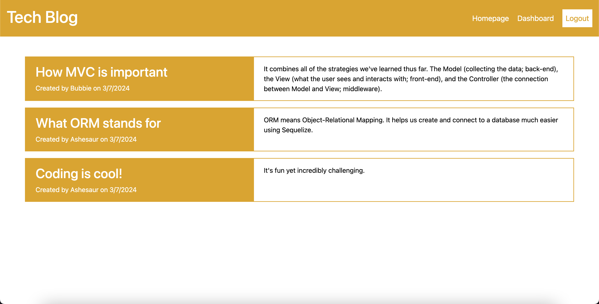
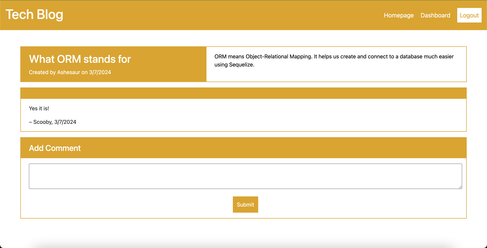
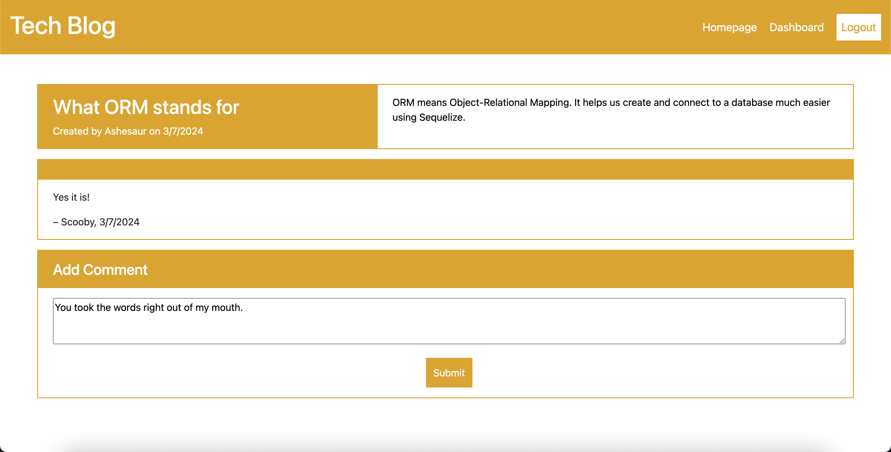
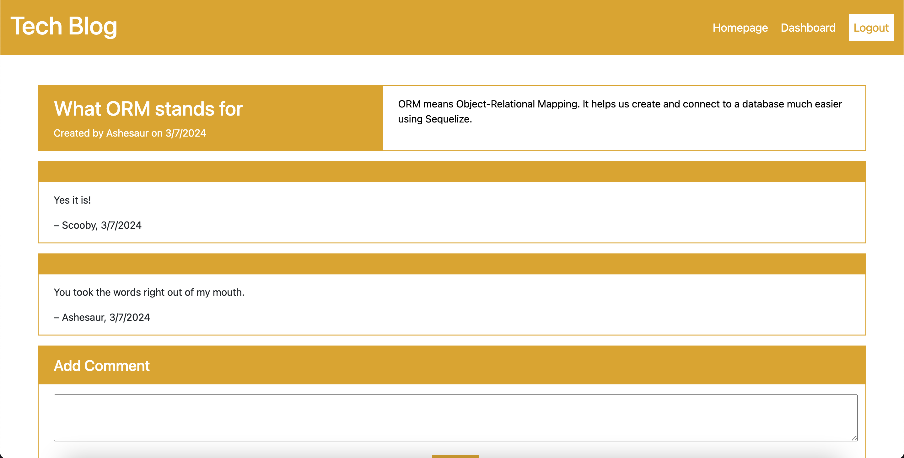

# Challenge 14: Model-View-Controller Tech Blog


## Description

For this assignment, we had to build a full blown tech blog application from scratch using MVC. This was definitely a challenging assignment since it involves a lot of folders and files and knowing how and where to connect what. We were required to use the following packages in our application: express-handlebars, MySQL2, Sequelize, dotenv, bcyrpt, express-session, and connect-session-sequelize. While it was incredibly challenging, it did help me understand how the MVC paradigm works and how things are connected to each other to work correctly. Here were the User Story and Acceptance Criteria.

## User Story

```md
AS A developer who writes about tech
I WANT a CMS-style blog site
SO THAT I can publish articles, blog posts, and my thoughts and opinions
```

## Acceptance Criteria

```md
GIVEN a CMS-style blog site
WHEN I visit the site for the first time
THEN I am presented with the homepage, which includes existing blog posts if any have been posted; navigation links for the homepage and the dashboard; and the option to log in
WHEN I click on the homepage option
THEN I am taken to the homepage
WHEN I click on any other links in the navigation
THEN I am prompted to either sign up or sign in
WHEN I choose to sign up
THEN I am prompted to create a username and password
WHEN I click on the sign-up button
THEN my user credentials are saved and I am logged into the site
WHEN I revisit the site at a later time and choose to sign in
THEN I am prompted to enter my username and password
WHEN I am signed in to the site
THEN I see navigation links for the homepage, the dashboard, and the option to log out
WHEN I click on the homepage option in the navigation
THEN I am taken to the homepage and presented with existing blog posts that include the post title and the date created
WHEN I click on an existing blog post
THEN I am presented with the post title, contents, post creator’s username, and date created for that post and have the option to leave a comment
WHEN I enter a comment and click on the submit button while signed in
THEN the comment is saved and the post is updated to display the comment, the comment creator’s username, and the date created
WHEN I click on the dashboard option in the navigation
THEN I am taken to the dashboard and presented with any blog posts I have already created and the option to add a new blog post
WHEN I click on the button to add a new blog post
THEN I am prompted to enter both a title and contents for my blog post
WHEN I click on the button to create a new blog post
THEN the title and contents of my post are saved and I am taken back to an updated dashboard with my new blog post
WHEN I click on one of my existing posts in the dashboard
THEN I am able to delete or update my post and taken back to an updated dashboard
WHEN I click on the logout option in the navigation
THEN I am signed out of the site
WHEN I am idle on the site for more than a set time
THEN I am able to view posts and comments but I am prompted to log in again before I can add, update, or delete posts
```

## Screenshots
Landing page

Login or Signup page

Dashboard

Creating a post

Dashboard once a post is created for selected user

Editing a post

Homepage with new post

Inside of selected post

Adding a comment

Comment added


## Table of Contents

- [Installation](#installation)
- [Usage](#usage)
- [Contributing](#contributing)
- [Tests](#tests)
- [License](#license)
- [Questions](#questions)

## Installation

Once this repo has been cloned to your local system and opened in VS Code, you will need to install all the required packages. In your terminal, run `npm i` and it will install the necessary packages. You'll also need to update your user and password in the .env file so the mysql database will be able to connect. Run the schema.sql file in the db folder and then install the seeds by entering `npm run seed` in the terminal.

## Usage

To start the database, run `npm start` in the terminal. You can then use the localhost link to play around with the page locally. 

## Contributing

N/A

## Tests

N/A

## License
MIT License

---

## Questions

Any questions you may have, please feel free to reach out to me using either contact.<br>
GitHub Profile: https://github.com/ashpfander<br>
Email: ashmpfander@gmail.com